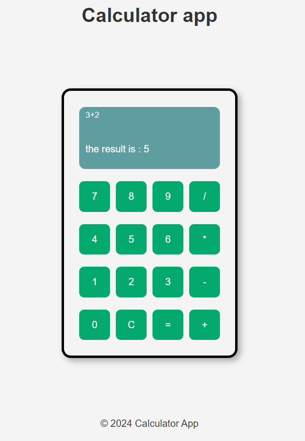

# Flask Calculator App



## Description

This is a simple calculator application built using Flask. It allows users to perform basic arithmetic operations such as addition, subtraction, multiplication, and division.

## Features

- Addition
- Subtraction
- Multiplication
- Division

## Usage

1. Run the Flask app:

    ```bash
    python calc_app.py
    ```

2. Open your web browser and go to `http://localhost:9000` to access the calculator app.

3. Perform calculations by entering expressions.


## Contributing

Contributions are welcome! If you'd like to contribute to this project, please fork the repository and submit a pull request.

## Video Demonstration

Check out this video demonstration of the calculator app on YouTube: [Calculator App Demo](https://youtu.be/j8_xd0HsMr0)


